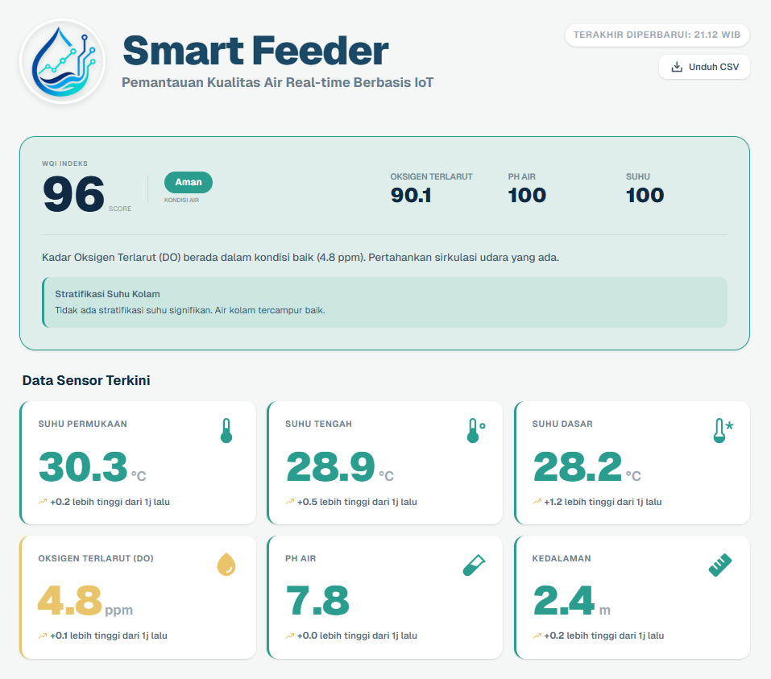
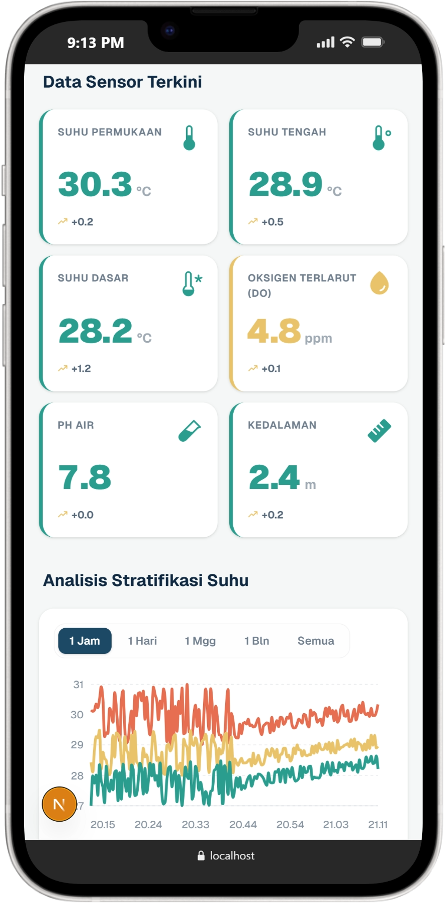
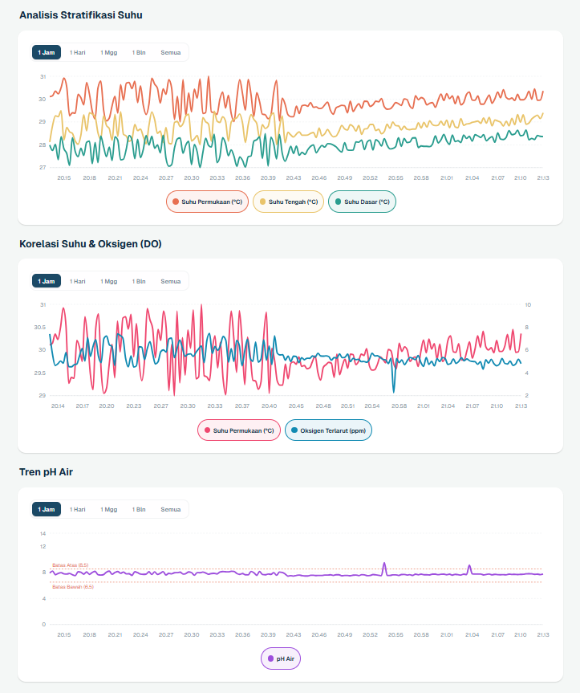

# Smart Feeder Dashboard

<p align="center">
  
  
  
  
  
  
</p>

<p align="center">
  Smart aquaculture monitoring dashboard with real-time analytics and intelligent insights
</p>


<p align="center" style="display:flex; justify-content:center; gap:10px;">
  
</p>

## Overview

The Smart Feeder Dashboard is built to transform raw sensor data into meaningful information. By monitoring critical parameters like Dissolved Oxygen (DO), pH levels, and Temperature stratification, it helps aquaculture operators maintain optimal conditions for aquatic life, reducing risks and improving yield.

## Key Features

- **Real-Time Monitoring**: Instant visualization of 6 critical sensor metrics with trend indicators.
- **Water Quality Index (WQI)**: An automated scoring system (0-100) that summarizes overall water health.
- **Advanced Analytics**:
  - **Temperature Stratification**: Analysis of Surface, Mid, and Bottom temperatures to detect upwelling.
  - **Correlation Mapping**: Visualizing the relationship between Temperature and Dissolved Oxygen.
  - **pH Trend Analysis**: Monitoring acidity levels with predefined safety thresholds.
- **Progressive Web App (PWA)**: Fully responsive, mobile-first design that can be installed on mobile devices for a native-like experience.
- **Data Export**: One-click CSV export for external research and historical auditing.
- **Auto-Refresh**: Seamless background data synchronization every 30 seconds.

<p align="center" style="display:flex; justify-content:center; gap:10px;">
  
  
</p>

## Getting Started

### Prerequisites

- Node.js 18.x or later
- npm or yarn

### Installation

1. Clone the repository:
   ```bash
   git clone https://github.com/HusniAbdillah/Smart-Feeder-Web.git
   ```

2. Install dependencies:
   ```bash
   npm install
   ```

3. Configure Environment Variables:
   Create a `.env.local` file in the root directory and add your ThingSpeak credentials:
   ```env
   THINGSPEAK_CHANNEL_ID=your_channel_id
   THINGSPEAK_READ_API_KEY=your_api_key
   ```

4. Run the development server:
   ```bash
   npm run dev
   ```

5. Build for production:
   ```bash
   npm run build
   ```

## License

This project is developed for aquaculture optimization and research purposes.
